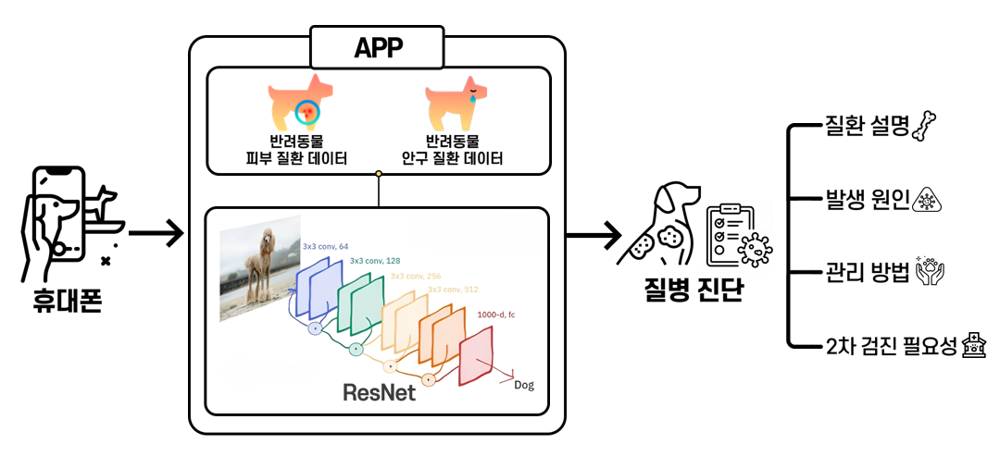
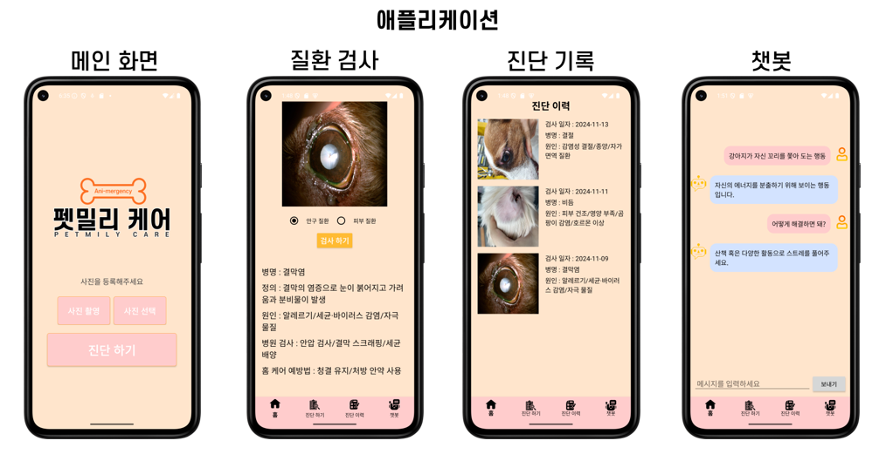
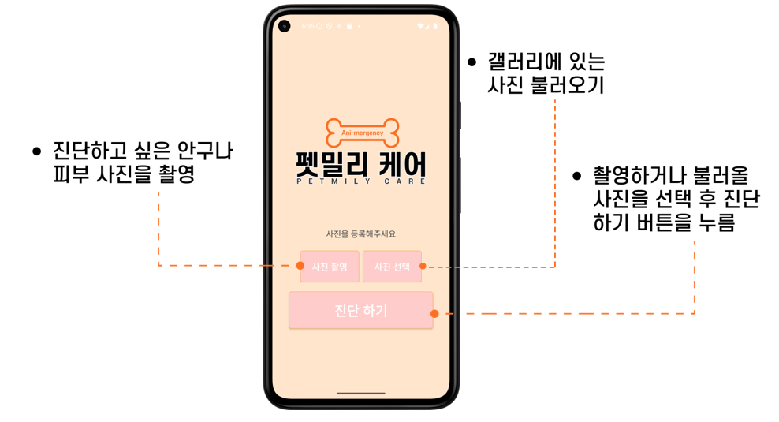
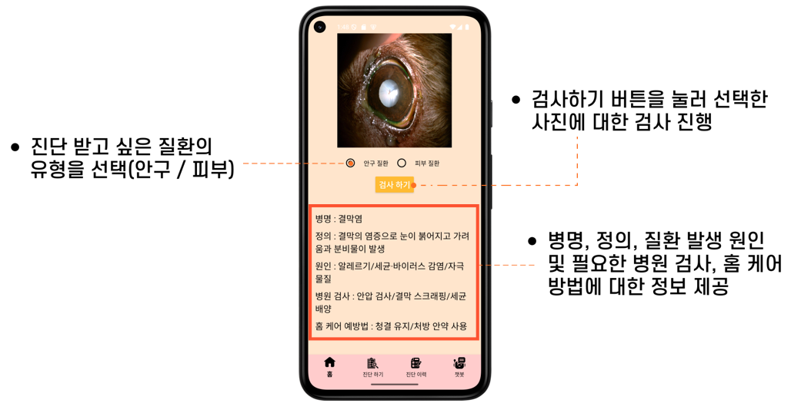
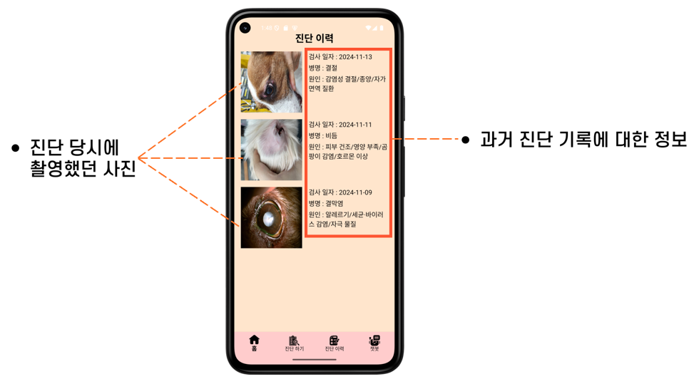
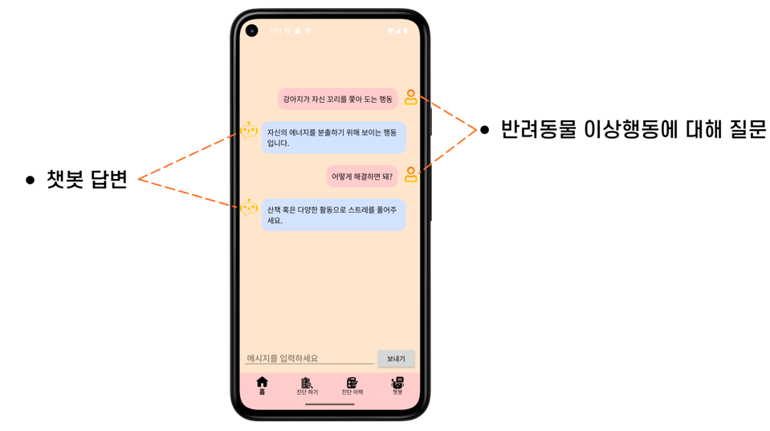

# 펫밀리케어(Petmily_care)
반려동물 조기질환 AI 애플리케이션

반려동물들의 이미지를 분석하여 질병 여부와 질병에 관한 정보를 알려주는 애플리케이션입니다.
AI 모델, Backend 서버, Frontend 앱으로 구성된 풀스택 프로젝트입니다.

## 프로젝트 내용
| 항목 | 내용 |
|------|------|
|**프로젝트명** | Petmily_Care |
| **개발기간** | 2024.10 ~ 2024.12 |
| **주요기술** | Python, ResNet, Yolov5, FastAPI, Android Studio, My SQL |
| **데이터 규모** | 반려동물 이미지 200,000장 |
| **성과** | 정확도 91%, 앱 연동 성공 |

## 프로젝트 개요 
- 반려동물 시장이 매년 성장하는 만큼 동물병원에 대한 수요도 지속적으로 증가하였지만 동물병원을 이용하는 소비자들의 불만 중 60.9%는 진료비와 관련된 문제였다.
- 이러한 경제적 부담은 반려동물 유기와 파양의 주요 원인으로 작용하여, 또 다른 사회 문제로 이어지고 있다.
- 이에 본 프로젝트는 반려동물의 외상 질환을 조기에 검출하고 1차 진단이 가능한 애플리케이션을 개발하여
보호자의 경제적 부담을 줄이며, 반려동물 유기 및 파양 문제 개선에 이바지하고자 진행하였습니다.

## 시스템 구조

## 시스템 아키텍쳐

## 앱 기능 구현

### 사진촬영및 첨부

### 진단 및 정보 제공

### 진단기록(사진, 내용)

### 챗봇

